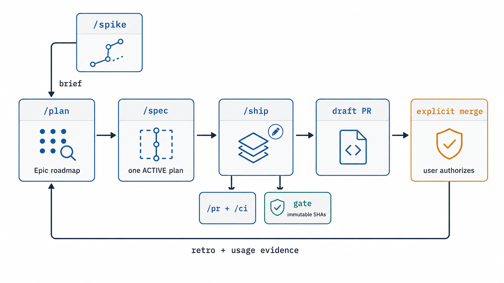
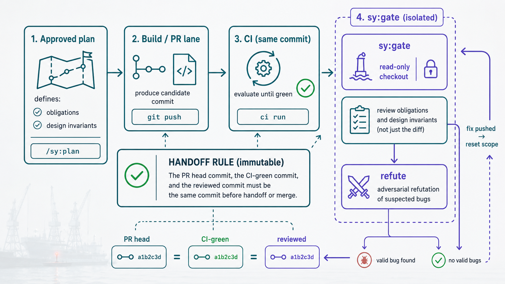
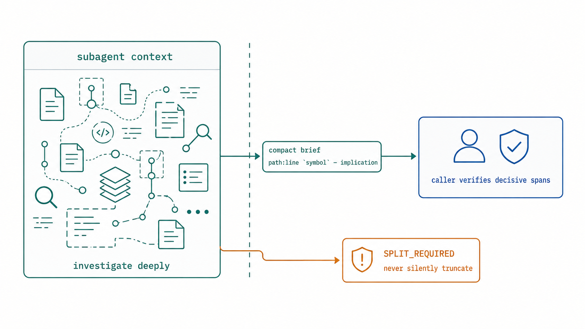
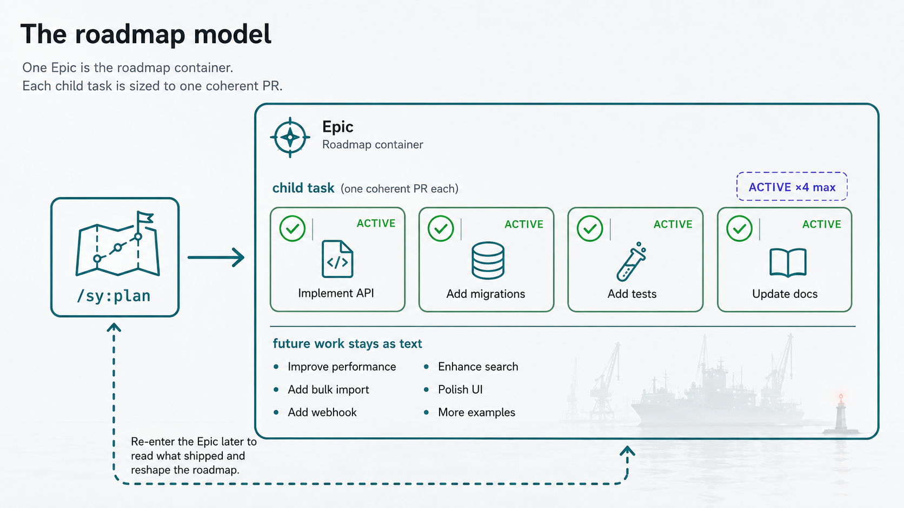
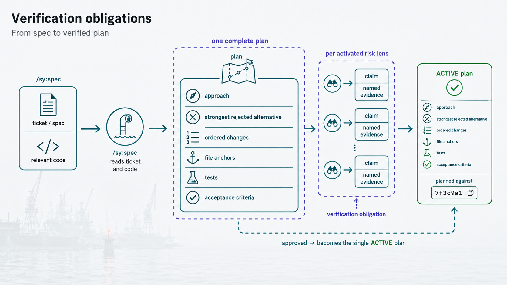
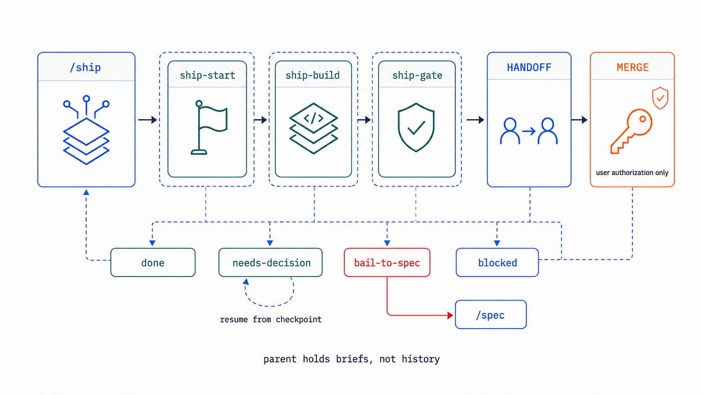
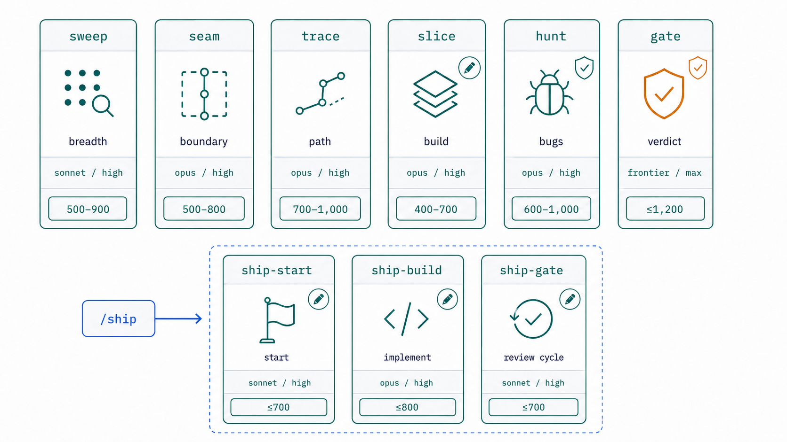

# Shipyard — `/sy:plan → /sy:spec → /sy:ship`


Shipyard is a Claude Code plugin that takes an objective from "we should build this" to a merged, independently reviewed pull request — with the whole trail recorded on your issue tracker, **Jira or GitHub Projects**. You plan a roadmap once, then repeat a short loop per task: spec it, ship it, merge it. Claude does the building and the reviewing; you approve the plan and authorize the merge.

## What you get

Point Shipyard at a task and it produces a PR that is ready to merge: the change is built to an approved plan, CI is green, and an independent reviewer has signed off on the exact commits you are about to merge. Alongside the PR, the ticket carries the full paper trail — the plan it was built against, a retrospective, token and outcome logs, and the session transcript — so the "why" survives long after the diff is gone. Only you merge, and nothing merges without your explicit word.



## Why it works this way

Two convictions shape everything, and both exist to earn your trust in the output.

**The review is adversarial, and it reviews exactly what you'll merge.** A separate `sy:gate` agent — running on a frontier-tier model, in its own read-only checkout pinned to the pushed commits — reviews the plan's obligations and design invariants, not just the diff, and every bug it suspects must survive an attempt to refute it before it is reported. If a fix is pushed, the review scope resets: the PR head, the CI-green commit, and the reviewed commit must be the *same commit* before anything hands off or merges. You are never reviewing one thing and merging another.



**Context holds decisions, not noise.** Reading fifty files to answer one question is fine — but it happens inside a disposable agent, and what comes back is a short brief of pointers backed by checkable evidence, not the raw transcript. The orchestrator stays clear-headed across a long build because it holds compact briefs rather than everything it read. In practice that means sharper decisions late in a task, not just a cheaper one.



## The loop

| What you have | What you type |
|---|---|
| a large objective or an existing roadmap | `/sy:plan` |
| one PR-sized task that needs an executable plan | `/sy:spec <task>` |
| an approved plan ready to build | `/sy:ship <task>` |
| a hunch that needs data before it becomes a project | `/sy:spike …` |
| a branch that needs its PR created or tidied | `/sy:pr` |
| a failing or pending CI run to diagnose | `/sy:ci` |
| a decision, bug, or system you want to genuinely understand before acting on it | `/sy:explain …` |

`<task>` is an issue ID — a Jira key like `PROJ-123` or a GitHub issue like `#123`. Shipyard never parses IDs; it passes them straight through to the configured tracker.

**Tip:** each command runs a long session, so name it at launch — `claude -n "spec PROJ-123 add billing" "/sy:spec PROJ-123"` — and it is easy to find again later. See [`docs/usage.md`](docs/usage.md).

### Plan

`/sy:plan` interviews you one question at a time, maps the code with read-only agents, and writes a living roadmap onto one Epic. Executable work becomes direct child tasks, each sized to one coherent PR; at most four are active at once, and everything further out stays as text until it is close enough to spec. Re-enter with `/sy:plan <epic>` to read what shipped and reshape the roadmap.



### Spec

`/sy:spec <task>` reads the ticket and the code, resolves the repo's engineering standards, and presents a complete plan for your approval: the approach and the strongest rejected alternative, ordered changes with file anchors, tests and acceptance criteria, and a verification obligation — a claim plus the named evidence that will prove it — for every risk lens the work activates. You approve before anything is built; the plan lands on the ticket as the single ACTIVE plan, stamped with the commit it was planned against. Not every spec ends in a plan: when research shows the premise is already delivered, invalidated, or superseded, spec shelves the task with evidence instead of building on a premise that no longer holds.



### Ship

`/sy:ship <task>` builds the approved plan to a reviewable PR. It branches from fresh `origin/main` into its own worktree, implements the plan in order, discharges each verification obligation with its named evidence, gets CI green, and runs the immutable gate above. When head, CI-green, and reviewed commits converge, it posts the evidence, moves the task to `in-review`, and stops. You merge; then what shipped feeds the next planning round.



## Under the hood

The workflow skills stay small and delegate expensive reads and builds to a fleet of specialist agents, each in its own context with its own model, each returning a compact brief. `/sy:ship` in particular runs each phase — start, build, gate — as a disposable worker, so the orchestrator owns only the durable state and the conversation with you, while the heavy lifting happens in fresh contexts that never accumulate.



The issue tracker is the one pluggable part. Core skills and agents speak a single [tracker contract](skills/tracker/CONTRACT.md) — canonical verbs, five lifecycle statuses (named per repo), and canonical types — and a thin adapter maps that to Jira or to GitHub Projects. `SY_TRACKER` selects one, and a validator keeps tracker-specific vocabulary out of every core file. The GitHub tracker needs **no organization**: it drives issue Type and Status as Projects v2 fields, which work the same on a personal board.

Some lessons outlive a single ticket — a CLI flag with inverted semantics, a model that silently falls back to a default. Those go into a small, user-global memory store (`scripts/sy_memory.py`, one file per lesson plus a greppable index) rather than a ticket comment or a repo's `CLAUDE.md`. `/sy:plan` and `/sy:spec` read it during early research and `/sy:ship` at start; new lessons get written, at most a few at a time, during ship's retrospective. It is cross-repo by design, so a trap learned once does not have to be relearned in the next repo next month.

## Install and configure

**Already running Claude Code?** Paste this and let it drive the setup: "Help me install and configure Shipyard in this repo. Read https://raw.githubusercontent.com/bretttully/shipyard/main/agent-guide.md first, then walk me through it step by step."

Shipyard is a plugin, so it is loaded, not symlinked:

```bash
claude --plugin-dir /path/to/shipyard         # this session only

# persistent: this repo ships a marketplace manifest, so add it, then install the plugin
claude plugin marketplace add bretttully/shipyard  # a GitHub owner/repo (cloned for you) or a local path
claude plugin install sy@shipyard             # or run /plugin and enable "sy"
```

`./install.sh` validates the plugin and prints these instructions with a tracker-aware preflight. The details live in the docs:

- [`docs/installation.md`](docs/installation.md) — loading the plugin and the CLI tools it needs.
- [`docs/settings.md`](docs/settings.md) — every configuration knob, with copy-paste `settings.json` for Jira and GitHub.
- [`docs/github-setup.md`](docs/github-setup.md) — one-time GitHub Projects board setup.
- [`docs/usage.md`](docs/usage.md) — the day-to-day loop and the session-naming pattern.

## The rules it holds itself to

- exactly one execution plan is ACTIVE per task; a newer plan supersedes the old one explicitly;
- plans record the commit they were written against; building on a materially drifted base is refused;
- every agent that writes code gets its own isolated worktree, kept beside the repo (or wherever `SY_WORKTREE_ROOT` points) so parallel work never collides;
- `sy:gate` reviews pinned base/head commits in an isolated, read-only checkout, and every bug candidate must survive an adversarial refutation before it is reported;
- the PR head, the CI-green commit, and the reviewed commit must be identical before handoff or merge;
- nothing merges without direct user authorization.

## Layout

```text
shipyard/
  .claude-plugin/plugin.json      # name: sy, version 1.0.0
  hooks/hooks.json                # review guard + usage accounting (plugin-level)
  scripts/                        # tracker-agnostic: validate.py, session_usage.py, review_guard.py, sy_memory.py, ci_poll.sh
  agents/                         # sweep seam trace slice hunt gate img-inspector explain-author ship-{start,build,gate}
  skills/
    plan/ spec/ ship/ spike/ pr/ ci/ standards/ explain/
    tracker/
      SKILL.md CONTRACT.md        # the seam: selection + canonical vocabulary
      jira/    ADAPTER.md + md_to_adf.py jira_rest.py references/
      github/  ADAPTER.md + gh_project.py
  docs/
    installation.md settings.md usage.md github-setup.md design-language.md smoke_github.sh img/
```

## Contributing

See [`CONTRIBUTING.md`](CONTRIBUTING.md). Run `python scripts/validate.py` before every PR; the seam and contract-completeness checks are not optional.


